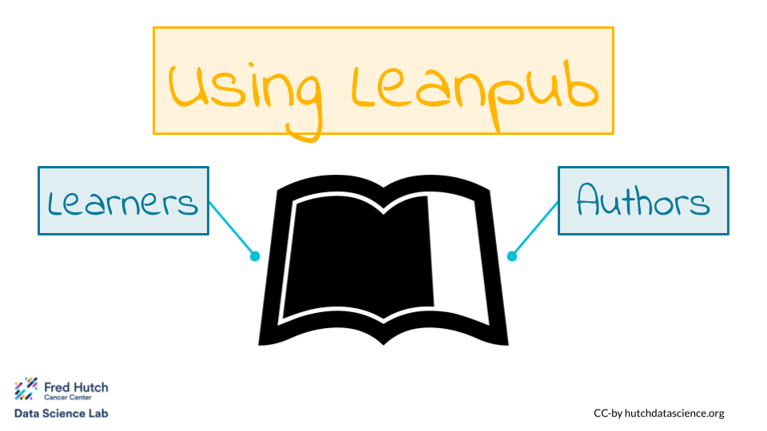

# Overview {-}

The goal of this book is to make using the [Leanpub](https://leanpub.com) course platform easier!

If you are a **learner** hoping to use Leanpub, check out the "Guide for Learners" tab on the left.

If you are an **educator** or **developer** hoping to use Leanpub to create courses, check out the "Guide for Developers". There, you can determine your role as a course writer.
