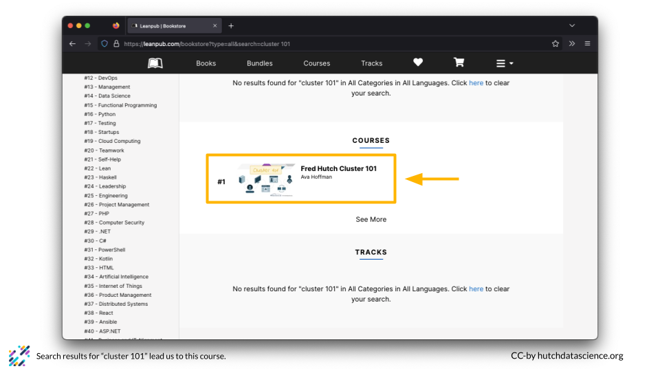
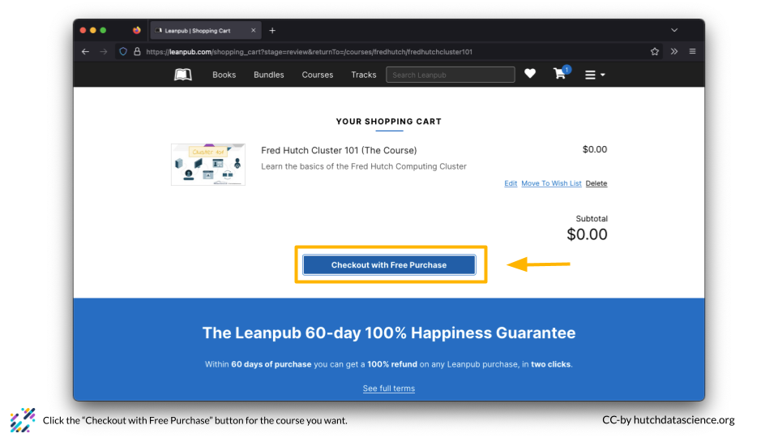
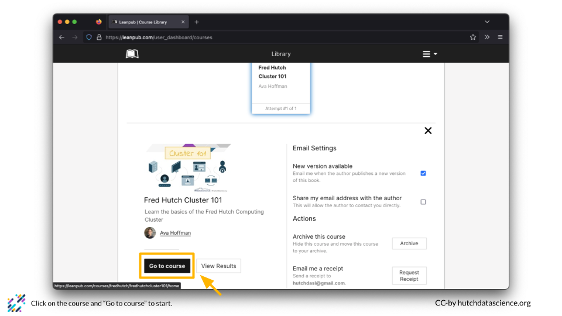

# (PART\*) Guide for Students {-}

# What is Leanpub

:::: {.borrowed_chunk}

Leanpub is a platform where authors self-publish ebooks and online courses. It's a great way to take courses for free while adding more functionality that a simple website. Paid courses also pay royalties to the authors.

::::

# Make a Leanpub Account

:::: {.borrowed_chunk}

To start account creation, click on the hamburger menu on the top right and click the "Sign Up" button.

Fill out your name and email. Choose a username and password and click "Create Account".

Confirm you are logged in. You should see your name. This is important for putting your name on a completion certificate later!

::::

# Find a Course

:::: {.borrowed_chunk}

You can use the Leanpub search function to find a topic you are interested in. For example, you might go to https://leanpub.com/ and search "cluster 101".

If you scroll down in the search results, you'll see the Fred Hutch Cluster 101 course under "COURSES".

::::

:::: {.borrowed_chunk}

You can go directly to the Fred Hutch Leanpub page at https://leanpub.com/p/fredhutch. All of Fred Hutch's Leanpub courses are listed there.
::::

# Start a Course

:::: {.borrowed_chunk}

You can start a course on Leanpub and come back at any time. First, click on the course you want to take. Click "Add Course to Cart". You will need to do this even if you take the course for free.

Click "Checkout with Free Purchase" if you are taking the course for free.

Click "Complete Free Purchase".

This takes you back to the home page, which can be a bit confusing!

You can get back to the course by clicking the hamburger menu, selecting "Library", and "Courses". You can also go directly to https://leanpub.com/user_dashboard/courses.

You should see your course listed in your "Courses" tab.

Click on the course, and click "Go to course".

Click "Start the Course".

::::

# Navigate a Course

:::: {.borrowed_chunk}

The front page of a Leanpub course looks like this. You will see a table of contents on the left and the course materials on the right. 

You can also locate any quizzes associated with the course.

Click anywhere on the course materials panel to enlarge the content.

::::

# (PART\*) Guide for Course Developers {-}
