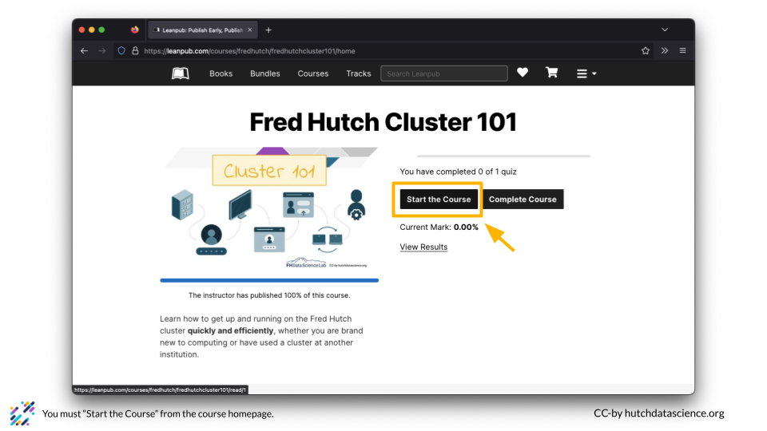

# (PART\*) Guide for Learners {-}

# What is Leanpub

:::: {.borrowed_chunk}

Leanpub is a platform where authors self-publish ebooks and online courses. It's a great way to take courses for free while adding more functionality that a simple website. Paid courses also pay royalties to the authors.


::::

# Make a Leanpub Account

:::: {.borrowed_chunk}

Use the following steps to create a new Leanpub account.

1. Click on the hamburger menu on the top right and click the "Sign Up" button.

    

1. Fill out your name and email. Choose a username and password and click "Create Account".

    

1. Confirm you are logged in. You should see your name. This is important for putting your name on a completion certificate later!

    
::::

# Find a Course

:::: {.borrowed_chunk}

You can use the Leanpub search function to find your course. 

1. First, you should search the course name or topic. For example, you might go to https://leanpub.com/ and search "cluster 101".

    

1. If you scroll down in the search results, you'll see the Fred Hutch Cluster 101 course under "COURSES". Click on the course to learn more.

    
::::

:::: {.borrowed_chunk}

You can go directly to the Fred Hutch Leanpub page at https://leanpub.com/p/fredhutch. All of Fred Hutch's Leanpub courses are listed there.
::::

# Start a Course

:::: {.borrowed_chunk}

You can start a course on Leanpub and come back at any time. 

1. First, click on the course you want to take. Click "Add Course to Cart". You will need to do this even if you take the course for free.

    

1. Click "Checkout with Free Purchase" if you are taking the course for free.

    

1. Click "Complete Free Purchase".

    

1. This takes you back to the home page, which can be a bit confusing! You can get back to the course by clicking the hamburger menu, selecting "Library", and "Courses". You can also go directly to https://leanpub.com/user_dashboard/courses.

    

    

1. You should see your course listed in your "Courses" tab.

    

1. Click on the course, and click "Go to course".

    

1. Click "Start the Course".

    
::::

# Navigate a Course

:::: {.borrowed_chunk}

Each Leanpub course has a few different elements.

1. The front page of a Leanpub course looks like this. You will see a table of contents on the left and the course materials on the right. 

    

    

1. You can also locate any quizzes associated with the course.

    

1. Click anywhere on the course materials panel to enlarge the content.

    
::::

# Get a Certificate of Completion

:::: {.borrowed_chunk}

You will need to follow a few steps to get a certificate of completion in Leanpub.

1. You should make sure that you have completed any quizzes for the course and are happy with your score.

1. You should also make sure that your name is filled out in your profile at https://leanpub.com/user_dashboard/settings. Otherwise, your certificate will be anonymous!

    

1. Go to your course homepage. You can find your course homepage by going to https://leanpub.com/user_dashboard/courses and clicking on the correct course.

1. Click on "Complete Course". You will be able to see your scores.
 
    
    
 1. Click on "Generate Certificate". Your certificate will be emailed to you!
 
    
    
::::

# (PART\*) Guide for Course Developers {-}

# Check your Organizational Account

:::: {.borrowed_chunk}

You will need to be part of a paid plan or paid organizational plan to publish courses using a GitHub repository.

1. Check your user menu. If you see an organization listed, you are probably set up correctly. 

    
    
1. If you do not see an organization listed, you should contact your plan administrator and have them add you to the organizational account using directions [here](hutchdatascience.org/Using_Leanpub/). Alternatively, you can use a personal paid account.
 
    
    
::::

# Add Organization Editor

:::: {.borrowed_chunk}

```
## Warning in readLines(dest_file): incomplete final line found on 'resources/
## other_chapters/add_org_editor.Rmd'
```


Adding an editor to an organization makes it easy to add and update courses. 

1. Click on the hamburger menu, click on "Organization", and click the correct organization from the list. 

    
    
1. Click on the "Editors" tab and select "Add an Editor".

    
    
::::
