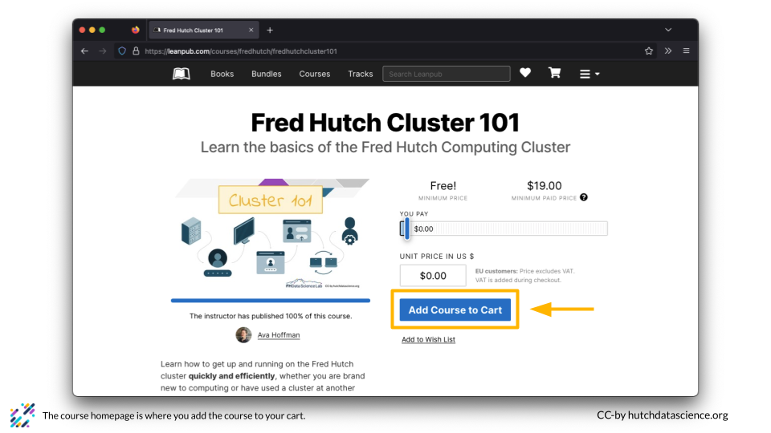
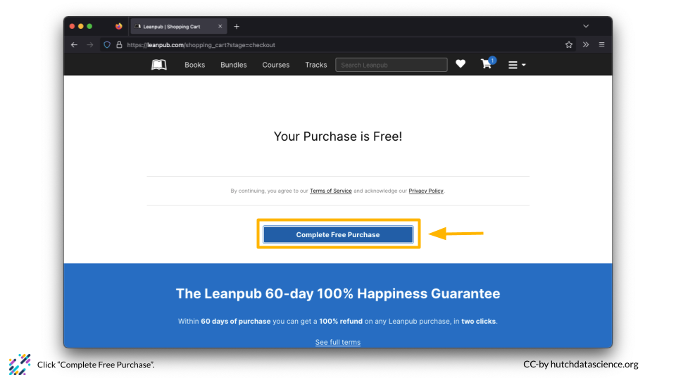
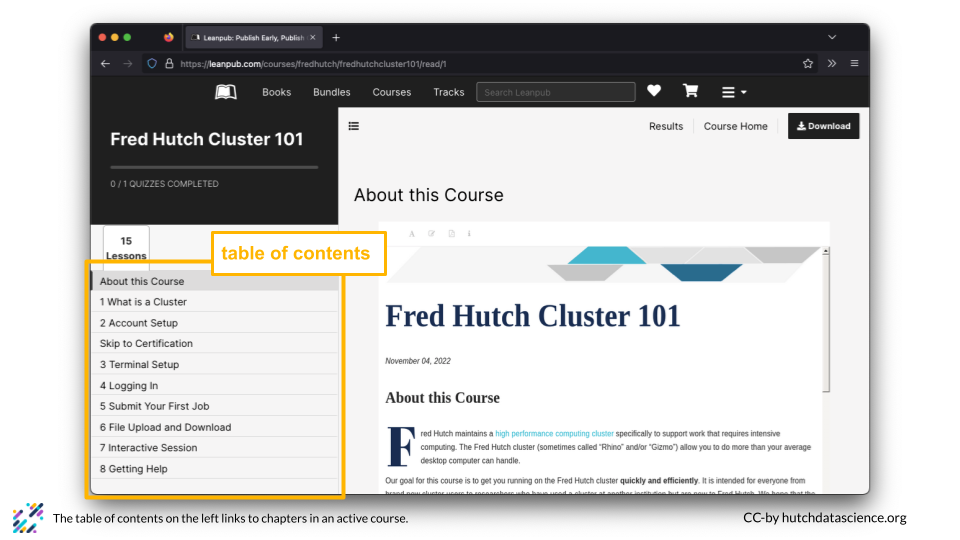
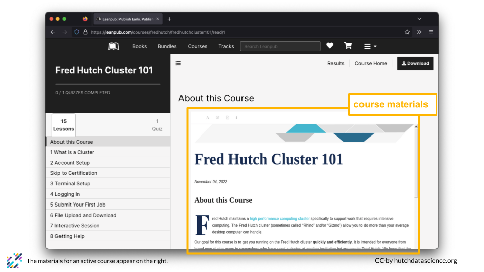
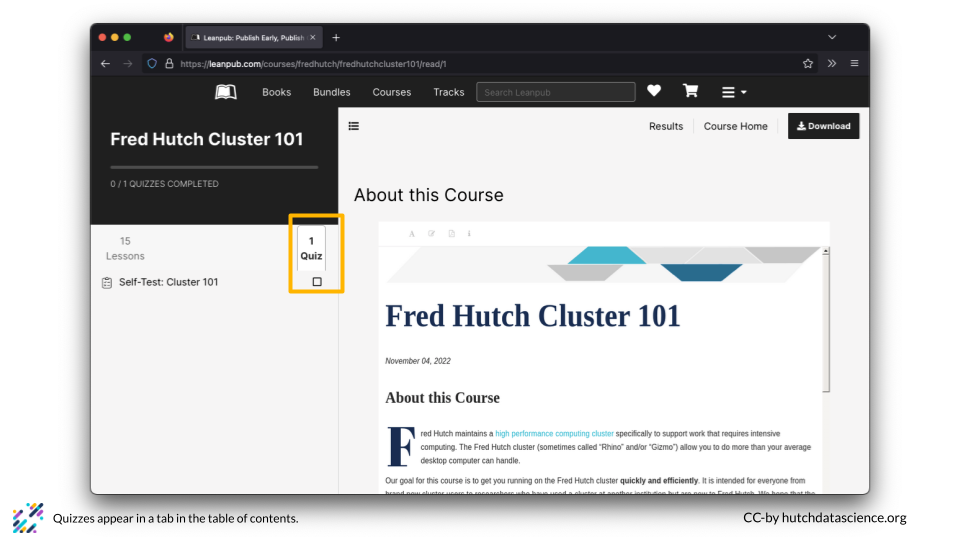
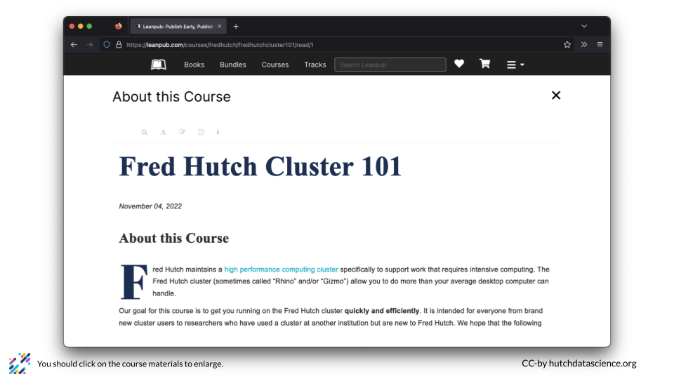
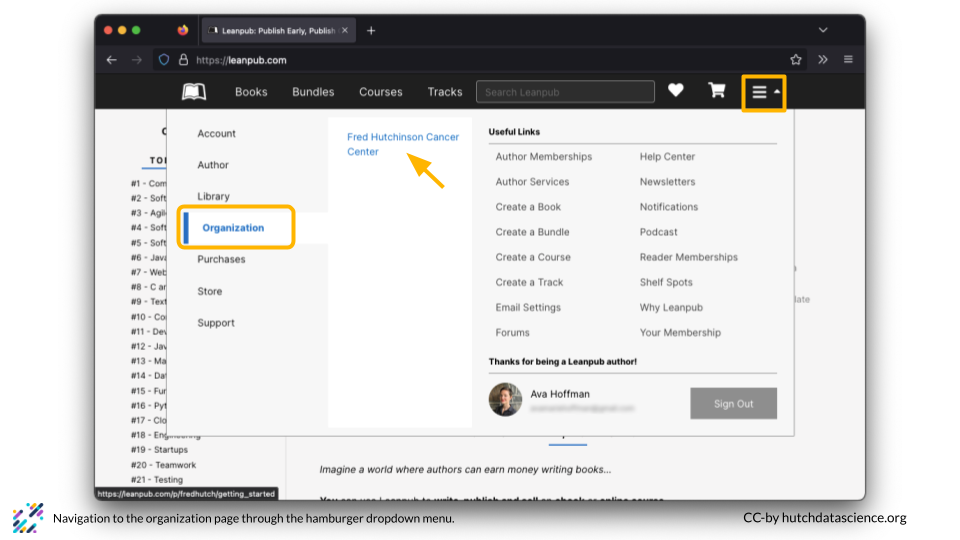
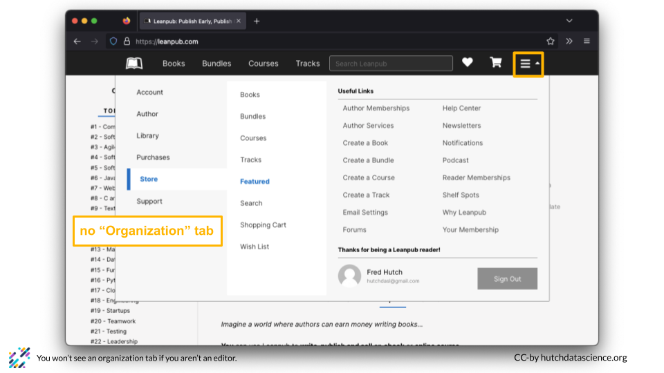

# About Leanpub

[Leanpub](https://leanpub.com) is a platform where authors self-publish ebooks and online courses. It's a great way to take courses for free while adding more functionality that a simple website. Paid courses also pay royalties to the authors.

# (PART\*) Guide for Learners {-}

# Make a Leanpub Account

Use the following steps to create a new Leanpub account.

1. Go to https://leanpub.com/sign_up. Fill out your name and email. Choose a username and password and click "Create Account".

    

1. Confirm you are logged in. You should see your name above your email address when you click on the hamburger dropdown menu.

    

:::: {.warning}
It is very important that you fill in your real name, otherwise it won't appear on your completion certificate!
::::

# Find a Course

You can use the Leanpub search function to find your course. 

1. First, you should search the course name or topic. For example, you might go to https://leanpub.com/ and search "cluster 101".

    

1. If you scroll down in the search results, you'll see the Fred Hutch Cluster 101 course under "COURSES". Click on the course to learn more.

    

:::: {.notice}

You can go directly to the Fred Hutch Leanpub page at https://leanpub.com/p/fredhutch. All of Fred Hutch's Leanpub courses are listed there.
::::

# Start a Course

You can start a course on Leanpub and come back at any time. 

1. First, click on the course you want to take. You can then drag the slider or type in a number for the price you want to pay.

    

1. Click "Add Course to Cart". You will need to do this even if you take the course for free.

    

1. Click "Checkout with Free Purchase" if you are taking the course for free.

    

1. Click "Complete Free Purchase".

    

1. This takes you back to the home page, which can be a bit confusing! You can get back to the course by clicking the hamburger menu, selecting "Library", and "Courses". You can also go directly to https://leanpub.com/user_dashboard/courses.

    

    

1. You should see your course listed in your "Courses" tab.

    

1. Click on the course, and click "Go to course".

    

1. Click "Start the Course".

    

# Navigate a Course

Each Leanpub course has a few different elements.

1. The front page of a Leanpub course looks like this. You will see a table of contents on the left and the course materials on the right. 

    

    

1. You can also locate any quizzes associated with the course.

    

1. Click anywhere on the course materials panel to enlarge the content.

    

1. Click the "X" on the top right to exit the enlarged view and go back to the table of contents view.

    

:::: {.notice}
Clicking to enlarge the content also allows you to interact with the materials, for example copying text or clicking links.
::::

# Get a Certificate of Completion

:::: {.warning}
_Before moving on you should:_

1. Make sure that you have completed any quizzes for the course and are happy with your score.

1. Make sure that your name is filled out in your profile at https://leanpub.com/user_dashboard/settings. Otherwise, your certificate will be completed by "anonymous"!

    
::::

You will need to follow a few steps to get a certificate of completion in Leanpub.

1. Go to your course homepage. You can find your course homepage by going to https://leanpub.com/user_dashboard/courses and clicking on the correct course.

1. Click on "Complete Course". You will be able to see your scores.
 
    
    
 1. Click on "Generate Certificate". Your certificate will be emailed to you!
 
    
    

# (PART\*) Guide for Developers {-}

# Developer Roles

As a course developer on Leanpub, you can have one of two roles:

1. **Author**

     An author gets credit for creating the course. Authors can propose that an organization should publish their books and courses. Authors still need an editor to approve any books or courses for an organization to publish them. 

1. **Editor**

     An editor can author courses and also has the power to approve/publish courses and invite other editors.

:::: {.warning} 
If you have not already, ensure you have [created an account on Leanpub](https://hutchdatascience.org/Using_Leanpub/make-a-leanpub-account.html).
::::

# Organizational Accounts

Leanpub has both free and paid plans for authors. However, you will need to be part of a paid plan or paid organizational plan. This will enable you to publish programmatically using a GitHub repository.

1. Check your user menu. If you see an organization listed, you are set up as an editor. 

    
    
1. If you do not see an organization listed, you are not set up as an editor.
 
    

:::: {.notice}
Contact an editor or administrator from your organization to be added as an author or editor.
::::

# Confirm your Role

When you are invited to an organization as an author or editor, you will need to accept the invitation from another member of the organization.

1. You should see a notification on the hamburger menu. Click on the hamburger menu, and then click on "Notifications". 

    
    
1. On the invitation notification, click "View".

    

1. Click "Accept Invitation".

    
    

# (PART\*) Guide for Authors {-}

# Create a Course for Authors

:::: {.warning}
_Before proceeding you should:_

1. Make sure that you have verified your email. Go to https://leanpub.com/author_dashboard/courses/unpublished and click the link to resend a verification email if you haven't yet verified your account.

    
::::

1. Go to https://leanpub.com/create/course. If your page looks different from below, make sure your email is verified (above). 

    
    
1. Fill in a title and URL. Select "In your browser on Leanpub". We will change this to "Using Git and Github" shortly.

    

1. Ensure you have selected the "FREE" plan.

    
    
1. Click "Sign up for the Free plan".

    
    
1. Once you have the course link, you should send this link to an editor of your organization. For example, you'd send https://leanpub.com/course_admin/leanpub/programming101.

# Accepting Organization Invitation

You will need to make a few updates to your Leanpub course to finalize setup.

1. Go to https://leanpub.com/author_dashboard/invitations/pending. You should see an invitation for your course. If you do not see an invitation for your course, check with your editor to ensure they have sent the invitation. Click "Accept".

    

1. Select the "Courses" tab and select "Unpublished" from the menu. You should see your course. Click on your course.

    

1. On the course homepage, select "Settings" and scroll down to select "Writing Mode".

    

    
    
1. Select the "GitHub" option. Fill in the link corresponding to your course repository on GitHub and click "Update your course".

    
    
:::: {.warning}
You must have a paid plan through your organization to use the GitHub writing mode.
::::

# (PART\*) Guide for Editors {-}

# Add an Author

:::: {.warning}
You must be editor to add an author to an organization.
::::

Adding an author to an organization makes it easy for them to request publication. Authors can propose that an organization should publish their books and courses. Authors still need an editor to approve any books or courses for your organization to publish them. 

1. Click on the hamburger menu, click on "Organization", and click the correct organization from the list. 

    
    
1. Click on the "Authors" tab and select "Invite an Author".

    

1. Fill out the new author's email and click "Send Invitation".

    
    
:::: {.warning}
Invitations can only be sent to users who already have a Leanpub account.
::::

# Add an Editor

:::: {.warning}
You must be editor to add another editor to an organization.
::::

Adding an editor to an organization makes it easy for them to add and update courses. Editors can always create a book or course in the organization, as well as invite authors to it.

1. Click on the hamburger menu, click on "Organization", and click the correct organization from the list. 

    
    
1. Click on the "Editors" tab and select "Add an Editor".

    

1. Fill out the new editor's email and click "Invite Editor".

    
    
:::: {.warning}
Invitations can only be sent to users who already have a Leanpub account.
::::

# Invite an Author's Course

You might want to invite another author's course to your organization on Leanpub. You will need to do the following:

1. Click on the hamburger menu, click on "Organization", and click the correct organization from the list. 

    
    
1. Click on "Courses" and select the "Invite a Course" button.

    

1. Under "SLUG", add the last part of the Course URL. For example, if you are inviting https://leanpub.com/course_admin/leanpub/programming101, you would type "programming101". Then click the "Send Invitation" button.

    

# Create a Course for Editors

:::: {.warning}
_Before proceeding you should:_

1. Make sure that you have verified your email. Go to https://leanpub.com/author_dashboard/courses/unpublished and click the link to resend a verification email if you haven't yet verified your account.

    
::::

1. Click on the hamburger menu, click on "Organization", and click the correct organization from the list. 

    
    
1. Select the "Courses" tab and select "Create a new course".

    

1. On the new course page, make sure "write it yourself" is selected.

    
    
1. Fill in a title and URL. Select "Using Git and Github".

    

1. Select "Add to plan".

    

